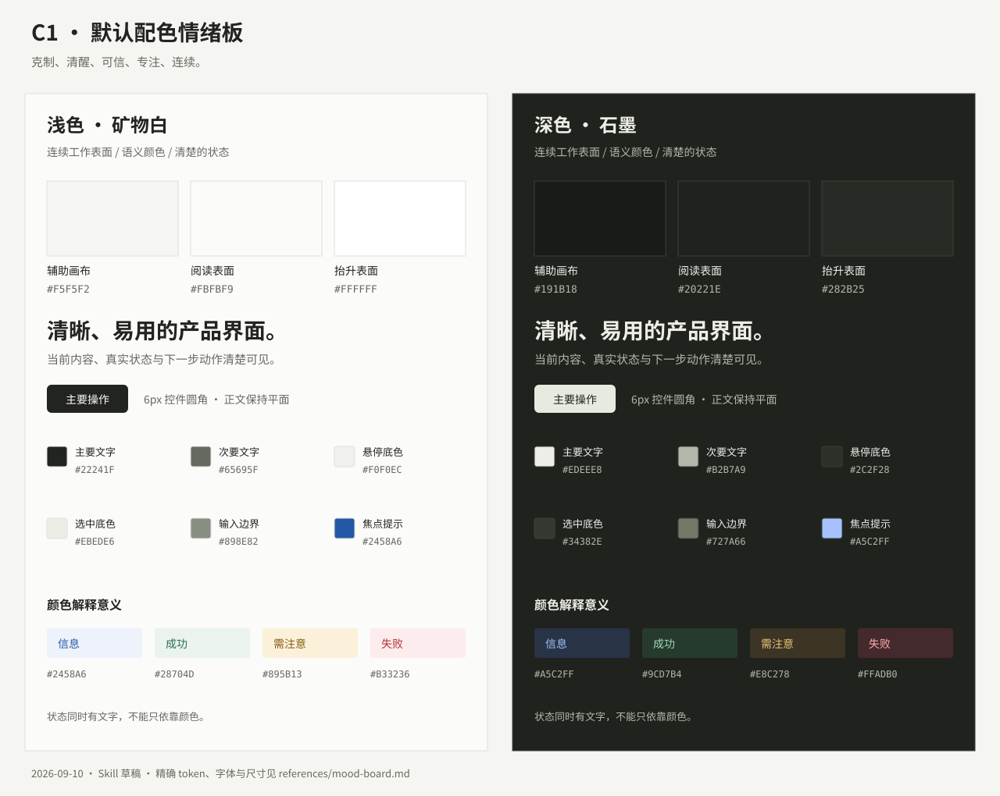

# 配色情绪板与排版

## 默认气质

**简单、易用、克制、精确。**

使用者会在桌面或手机上反复回到同一件工作，既要快速找到状态和动作，也要持续阅读。默认跟随系统选择深浅主题；两种主题保留相同的信息关系。

| 感受 | 视觉表达 | 使用体验 |
| --- | --- | --- |
| 克制 | 中性色为主体，少量语义色 | 内容与主操作先被看见 |
| 清醒 | 石墨色文字、清晰基线与边界 | 一眼分清标题、正文、说明 |
| 可信 | 稳定组件、明确状态、可追溯细节 | 用户能理解发生了什么 |
| 专注 | 平面内容、舒适行长、安静层次 | 长时间阅读与操作不疲劳 |
| 连续 | 渐进展开、稳定布局、保留工作状态 | 返回、切换与恢复都有接续 |

这是个人产品的默认情绪板，可被用户提供的新品牌方向替换。保留“颜色有语义、交互有反馈、正文可读”的约束，重新确定实际颜色与形状。

## 色彩标本



“矿物白”是略带绿灰的近白色。深色带同一组中性色倾向，层级通过表面亮度和文字对比建立。

颜色按用途命名，表面与其文字必须成对使用。

| 语义角色 | 浅色 | 深色 | 用途 |
| --- | --- | --- | --- |
| `background` | `#FBFBF9` | `#20221E` | 主要阅读画布 |
| `foreground` | `#22241F` | `#EDEEE8` | 正文与标题 |
| `card` / `popover` | `#FFFFFF` | `#282B25` | 输入、独立交互面与浮层 |
| `card-foreground` / `popover-foreground` | `#22241F` | `#EDEEE8` | 对应表面内的主要文字 |
| `muted` / `secondary` | `#F5F5F2` | `#191B18` | 导航和辅助工作区域 |
| `muted-foreground` | `#65695F` | `#B2B7A9` | 次要说明与元数据 |
| `secondary-foreground` | `#22241F` | `#EDEEE8` | 次要表面内的主要文字 |
| `hover` | `#F0F0EC` | `#2C2F28` | 安静的悬停反馈 |
| `accent` | `#EBEDE6` | `#34382E` | 轻量选中底色 |
| `accent-foreground` | `#22241F` | `#EDEEE8` | 选中内容的文字 |
| `primary` | `#22241F` | `#E7EBDF` | 主操作、强选中反馈 |
| `primary-foreground` | `#FBFBF9` | `#22241F` | 主按钮内文字与图标 |
| `border` | `#DFE1D9` | `#3C4037` | 普通分隔，不能代替必要的控件边界 |
| `border-strong` | `#B8BDB0` | `#727A66` | 较明显的分组边界 |
| `input` | `#898E82` | `#727A66` | 必要输入区域的可辨认边界 |
| `ring` | `#2458A6` | `#A5C2FF` | 键盘焦点 |

`secondary` 在此表示辅助表面；带轮廓的次按钮使用 `card` 底色。组件 variant 的名字可以沿用项目约定，不要让名称相同掩盖外观角色不同。

| 状态角色 | 浅色文字 / 底色 | 深色文字 / 底色 | 含义 |
| --- | --- | --- | --- |
| `info` / `info-bg` | `#2458A6` / `#EDF2FB` | `#A5C2FF` / `#283346` | 信息、执行中 |
| `success` / `success-bg` | `#28704D` / `#EAF3ED` | `#9CD7B4` / `#273A2E` | 已确认的保存或动作成功 |
| `warning` / `warning-bg` | `#895B13` / `#FBF1DA` | `#E8C278` / `#3C3424` | 待判断、需补充的信息 |
| `destructive` / `destructive-bg` | `#B33236` / `#FCECEE` | `#FFADB0` / `#44292D` | 失败、冲突或危险动作 |

状态提示可仅使用文字和图标；需要分组时才加淡底色。`ring` 与 `info` 当前取值相同，但职责独立。实心危险按钮另需配套 `destructive-foreground` 并验证对比，不能把深色主题的浅红当底色后仍配白字。

颜色集中定义，不在页面中随意添相近灰色。不要用颜色表达未经业务确认的完成；普通选中不染成“成功绿”。

## 字体与排版

```css
--font-sans: "Geist", "PingFang SC", "Noto Sans CJK SC", "Microsoft YaHei", sans-serif;
--font-mono: "Geist Mono", ui-monospace, monospace;
```

字体资源优先沿用项目的本地加载方式；新增自托管字体时随附其许可证。中文字体必须真实检查，不能只根据拉丁文字样板决定行高和字距。

| 角色 | 默认字号 / 字重 | 行高与使用方式 |
| --- | --- | --- |
| 页面标题 | 28px / 600 | 1.35–1.4；窄屏可降为 24px |
| 主要分区 | 20px / 600 | 1.35 |
| 文内标题 | 16px / 600 | 1.35 |
| 正文 | 15px / 400 | 1.8；长文可用 1.85 |
| 普通 UI | 14px / 400–500 | 1.55 |
| 紧凑 UI | 13px / 400–500 | 1.55 |
| 元数据 | 12px / 400–500 | 1.55–1.8；不用来承载重要说明 |
| 移动端普通输入 | 16px | 保留可读性与可操作性 |

产品 UI 采用稳定的 rem 尺度，不把标题做成随容器剧烈变化的展示字。

标题负字距最多约 `-0.025em`，中文密集时回到正常字距。正文约 65–75ch，以 70ch 为起点；中文按真实内容复核，不把英文字符单位当作中文字数。代码和长 URL 可局部滚动或合理换行。

Geist 用于正文、按钮、标签和普通数值。需要对齐的数据使用 tabular numerals；代码、路径、时间戳、版本与精确标识按需用 Geist Mono。不要把整张数据表都改成等宽字体。

## 间距、形状与动效

- 间距尺度：`4 / 8 / 12 / 16 / 20 / 24 / 32 / 40 / 48 / 64px`。
- 图标与文字约 8–12px；同组内容约 8–16px；组间约 24–32px。文档分区通常标题上方 32px、下方 12px。
- 桌面页面边距约 32–48px，手机约 20px。根据真实内容调整，避免大面积空白把主要操作推走。
- 边界 1px；普通控件圆角 6px，组合输入区 10px，浮层默认 12px；有分类意义的小标签可用 3px。
- 常规内容不用阴影。菜单或弹窗需要抬升时使用统一、有限的浮层阴影，不叠加装饰性大阴影。
- 动效起点：`160ms cubic-bezier(.2,.65,.3,1)`；优先透明度和少量位移，不让内容等待入场动画才可见。
